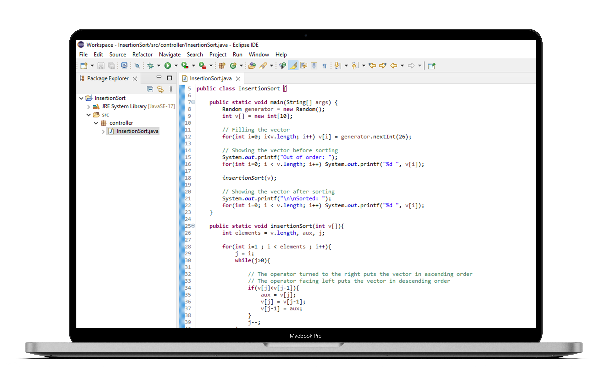

## Insertion Sort

This is a simple algorithm for sorting vectors using the Insertion Sort method.
A simple sorting algorithm that builds the final sorted list by transferring one element at a time.

The programming language used to build this program was Java.

In comparison to Bubble Sort and Selection Sort (both methods are covered in two repositories in my profile), the Insertion Sort method is the most efficient. Given a list, the current element is inserted into the appropriate position in the list, adjusting it every time a new element is changed. It is similar to arranging the cards in a card game.

<h1 align="center"> Insertion Sort </h1>

    <a title="Sobre" href="#-sobre">Sobre</a>&nbsp;&nbsp;•&nbsp;&nbsp;  
    <a title="Funcionalidades" href="#%EF%B8%8F-funcionalidades">Funcionalidades</a>&nbsp;&nbsp;•&nbsp;&nbsp;
    <a title="Tecnologias" href="#-tecnologias-utilizadas">Tecnologias</a>&nbsp;&nbsp;•&nbsp;&nbsp;
    <a title="Funcionamento" href="#-funcionamento">Funcionamento</a>&nbsp;&nbsp;•&nbsp;&nbsp;
    <a title="path" href="#-acesso-ao-projeto">path</a>&nbsp;&nbsp;•&nbsp;&nbsp;
    <a title="Autor" href="#-desenvolvedor">Autor</a>

    &nbsp;
    &nbsp;
    

 

    

### ✔️ Status: Concluído

## 🔎 Sobre

Este é um simples programa para ordenar arrays por meio do método Insertion Sort.
Um algoritmo de ordenação simples que constrói uma lista ordenada final através da transferência de um elemento de cada vez.

Em comparação com Bubble Sort e Selection Sort (ambos os métodos são cobertos em dois repositórios no meu perfil), o método Insertion Sort é o mais eficiente. Dada uma lista, o elemento atual é inserido na posição apropriada na lista, ajustando-o cada vez que um novo elemento é alterado. É semelhante a ordenar as cartas num jogo de cartas.

## ⚒️ Funcionalidades

* O programa deve ser capaz de ordenar vetores de forma crescente e decrescente.

## 🚀 Tecnologias utilizadas
<table>
    <tr>
        <td>Java</td>
    </tr>
</table>

## 📷 Funcionamento

    

## 📂 Acesso ao projeto 

Acesse a pasta do projeto clicando <a href="https://github.com/mmmello/Selection-Sort/tree/main/src">aqui</a>.

## 💻 Desenvolvedor
Matheus Mello, 2022
 
 

<i><h4 align="center">"Investir em conhecimento sempre renderá os melhores juros" 💭</h4></i>